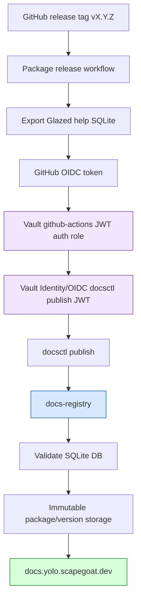

This tutorial is the operational playbook for adding `docsctl` documentation publishing to an existing go-go-golems package. Use it when going through open-source repositories one by one and wiring their release workflow so every GitHub release tag publishes versioned Glazed help documentation to `docs.yolo.scapegoat.dev`.

The target pattern is release-only and package-scoped. A repository publishes docs from its existing release workflow, the docs version is exactly the Git tag, GitHub Actions authenticates to Vault through OIDC, Vault mints a short-lived docs-registry publish JWT for that package, and `docsctl publish` uploads the generated SQLite help database to `https://docs-registry.yolo.scapegoat.dev`.

Docsctl rollout usually happens inside the broader release train. Before tagging a docs-enabled package, ensure the repository also has the generic `make bump-go-go-golems` target, run dependency bumps after upstream releases, run `make glazed-lint` when the repo depends on Glazed, and run `ggg release preflight --output json` before pushing the tag.

## Main-branch protection rule

Never push docsctl, release workflow, Terraform/Vault, generated help, or release-train cleanup changes directly to `main`. Use a branch and pull request, then merge only after CI/readiness checks pass. Tags are the only release-train operation that should be pushed directly, and only after the source commit is already merged to `main`.

## The target shape

A completed repository has these properties:

1. Its command can export Glazed help as SQLite in CI.
2. Its release workflow grants `id-token: write` only to the `publish-docs` job.
3. Its release workflow has a `publish-docs` job that calls the reusable workflow:
   `go-go-golems/infra-tooling/.github/workflows/publish-docsctl.yml@main`.
4. The publish job runs only for release tags, normally `refs/tags/v*`.
5. The publish job passes `package_version: ${{ github.ref_name }}` so docs URLs match GitHub releases.
6. Terraform/Vault contains a package-scoped GitHub Actions role and Vault Identity/OIDC token role named `docsctl-<package>-publisher`.
7. The live docs API shows the package and version after release:
   `https://docs.yolo.scapegoat.dev/api/packages`.

The public docs URL shape is:

```text
https://docs.yolo.scapegoat.dev/<package>/<version>
```

Examples:

```text
https://docs.yolo.scapegoat.dev/glazed/v1.3.4
https://docs.yolo.scapegoat.dev/pinocchio/v0.10.26
```

## Architecture overview



The registry does not trust GitHub directly. GitHub proves workflow identity to Vault. Vault checks repository, repository ID, workflow ref, job workflow ref, event, and tag/ref claims. Vault then mints a short-lived JWT whose `package` claim names exactly one docs package. The registry verifies that JWT offline and accepts the upload only when the signed package claim matches the route.

## Before you start

Collect these facts for the repository:

| Fact | How to find it | Example |
|---|---|---|
| Package name | Usually the docs URL/repo name, not necessarily the binary name | `pinocchio` |
| GitHub repository | `gh repo view --json nameWithOwner` | `go-go-golems/pinocchio` |
| Numeric repository ID | GitHub GraphQL `repository.databaseId` | `802670903` |
| Release workflow path | Exact file name under `.github/workflows/` | `.github/workflows/release.yml` |
| Release tag pattern | Inspect workflow `on.push.tags` | `v*` |
| Export command | Run command help locally | `GOWORK=off go run ./cmd/pinocchio help export --format sqlite --output-path .docsctl/help.sqlite` |
| Go version source | Usually `go.mod` | `go.mod` |

Run this from the target repo or with explicit owner/name:

```bash
gh repo view --json nameWithOwner,defaultBranchRef

gh api graphql \
  -f owner=go-go-golems \
  -f name=<repo> \
  -f query='query($owner:String!, $name:String!) { repository(owner:$owner, name:$name) { nameWithOwner databaseId defaultBranchRef { name } } }'
```

Record the numeric `databaseId`. Vault roles should bind `repository_id`, not only the mutable repository name.

Before editing Terraform or workflows, fill out this package identity checklist:

| Decision | Value |
|---|---|
| Public docs package name |  |
| Exporting binary / command directory |  |
| Export command |  |
| Release workflow path |  |
| Numeric GitHub repository ID |  |
| Vault auth role name | `docsctl-<package>-publisher` |
| Vault token role name | `docsctl-<package>-publisher` |
| Should examples/demo CLIs be excluded? |  |
| Does the package already appear in `/api/packages`? |  |

For multi-CLI repositories, do not let automation silently choose the first command that validates. Decide the public docs package name and canonical export command first.

## Step 0: align release-train prerequisites

Before wiring docs publishing, check the shared release-train baseline:

```bash
grep -n "bump-go-go-golems" Makefile || true
grep -n "glazed-lint" Makefile || true
ggg release preflight --repo . --output json || true
```

If logcopter is missing, add the generated package loggers first (`logcopter_generate.go`, checked-in `**/logcopter.go`, and `make logcopter-check`). If `bump-go-go-golems` is missing and the repo has direct `github.com/go-go-golems/...` requirements, add the `GOWORK=off` snippet from `examples/go-go-golems/Makefile.bump-go-go-golems-gowork-off.snippet.mk`. This keeps docsctl releases aligned with logcopter, xgoja, and Glazed dependency rollouts.

## Step 1: prove the package can export help locally

From the repository root, find the command package and verify it exposes Glazed help export.

Common command layouts:

```text
cmd/<package>/main.go
cmd/<binary>/main.go
```

Try the export command locally:

```bash
mkdir -p .docsctl
GOWORK=off go run ./cmd/<package> help export --format sqlite --output-path .docsctl/help.sqlite
test -s .docsctl/help.sqlite
```

Then validate the generated database if `docsctl` is available:

```bash
docsctl validate \
  --file .docsctl/help.sqlite \
  --package <package> \
  --version v0.0.0-local
```

If `docsctl` is not installed:

```bash
go install github.com/go-go-golems/glazed/cmd/docsctl@latest
docsctl validate \
  --file .docsctl/help.sqlite \
  --package <package> \
  --version v0.0.0-local
```

If the command does not support `help export`, first update that package to use the Glazed help command wiring. Do not add the publish workflow until export is reliable locally and in CI.

## Step 2: add or enable the release workflow job

Prefer publishing from the existing release workflow after release artifacts have been produced. In the go-template release workflow, the disabled template already has the intended shape:

```yaml
# Disabled template for publishing Glazed help docs to docs.yolo.scapegoat.dev.
publish-docs:
  name: Publish docs
  permissions:
    contents: read
    id-token: write
  needs:
    - goreleaser-merge
  if: ${{ startsWith(github.ref, 'refs/tags/v') }}
  uses: go-go-golems/infra-tooling/.github/workflows/publish-docsctl.yml@main
  with:
    package_name: <package>
    package_version: ${{ github.ref_name }}
    export_command: GOWORK=off go run ./cmd/<package> help export --format sqlite --output-path .docsctl/help.sqlite
    sqlite_path: .docsctl/help.sqlite
    docsctl_install_command: go install github.com/go-go-golems/glazed/cmd/docsctl@latest
    vault_role: docsctl-<package>-publisher
    vault_token_role: docsctl-<package>-publisher
    registry_url: https://docs-registry.yolo.scapegoat.dev
    verify_packages_url: https://docs.yolo.scapegoat.dev/api/packages
    verify_publish: true
```

Scope OIDC permission to the docs publishing job. Do not add `id-token: write` at workflow root unless every release job truly needs OIDC. The caller workflow may keep its existing top-level release permissions, for example:

```yaml
permissions:
  contents: write
```

The `publish-docs` job itself should request only what the reusable workflow needs:

```yaml
publish-docs:
  permissions:
    contents: read
    id-token: write
```

Without job-level `id-token: write`, `hashicorp/vault-action` cannot request a GitHub OIDC token. With workflow-level `id-token: write`, unrelated release jobs can mint OIDC tokens unnecessarily.

## Step 3: choose the right `needs:` dependency

The docs publish job should run after the release job that proves the tag is valid.

Common choices:

```yaml
needs:
  - goreleaser-merge
```

or, for simpler repositories:

```yaml
needs:
  - release
```

Avoid publishing docs before release artifacts are built. If docs publishing succeeds but the release fails, the docs site would advertise a version that is not actually released.

## Step 4: keep package version equal to the tag

Use the release tag as the docs package version:

```yaml
package_version: ${{ github.ref_name }}
```

Do not use `latest`, `main`, branch names, synthetic `sha-*` versions, or a hard-coded version for production releases. The registry treats release versions as immutable. If the same package/version is published again with identical bytes, the retry is accepted. If it is published with different bytes, the registry rejects it with:

```json
{"error":"version_already_exists"}
```

This is intentional. A published release tag should not silently mutate documentation content.

## Step 5: add the Vault/Terraform publisher role

The reusable workflow defaults to these role names:

```text
docsctl-<package>-publisher
```

Vault/Terraform must define two connected pieces for each package:

1. A GitHub Actions JWT auth role that accepts only the intended repository/release workflow claims.
2. A Vault Identity/OIDC token role that mints a `docsctl-publish` JWT with `package=<package>` and `aud=docs-registry`.

The relevant Terraform workspace is:

```text
/home/manuel/code/wesen/terraform/vault/github-actions/envs/k3s
```

Before running Terraform, source the Terraform repo env file, not the k3s env file:

```bash
cd /home/manuel/code/wesen/terraform
source .envrc
cd vault/github-actions/envs/k3s
terraform plan
```

The existing packages are the examples to copy:

```text
glazed
pinocchio
remarquee
sqleton
```

When adding a new package, bind at least:

- `repository_id` — numeric GitHub repo ID;
- `repository` — owner/name, useful for logs and clarity;
- `workflow_ref` — the package release workflow at tag refs;
- `job_workflow_ref` — the reusable workflow path/ref if the Vault role binds it;
- `event_name` — normally `push` for tag pushes;
- `ref` or equivalent ref claim — release tags only, normally `refs/tags/v*`.

Use release tag binding. Do not allow docs publishing from arbitrary branches unless there is an explicit staging registry and a separate staging package/version policy.

After editing Terraform:

```bash
terraform fmt
terraform plan
terraform apply
terraform plan
```

The final plan should be clean.

## Step 6: open the package PR

For each package repository, create a small PR that includes only the release workflow change and any help-export fixes required to make it work.

Checklist before opening:

```bash
go test ./...
GOWORK=off go run ./cmd/<package> help export --format sqlite --output-path .docsctl/help.sqlite
test -s .docsctl/help.sqlite
docsctl validate \
  --file .docsctl/help.sqlite \
  --package <package> \
  --version v0.0.0-local
rm -rf .docsctl
```

Do not commit `.docsctl/help.sqlite`. It is a generated release artifact.

The PR description should include:

- package name;
- release workflow path;
- export command;
- Vault role name;
- Terraform PR/commit that adds the role;
- local validation commands and output summary;
- expected first release tag to prove publishing.

## Step 7: merge and create a release tag

Docs publishing runs on tag push. A workflow file merged to `main` is not enough proof; the publish job must run in the release/tag context because Vault roles bind release tag claims.

After merge, create or reuse the normal release process. Prefer the `ggg` release helpers for Go modules because they compute the next semantic version, push the tag, and verify the module through `proxy.golang.org`.

Run release preflight before creating a durable public tag. Do this after any `make bump-go-go-golems` / `make glazed-lint` cleanup so preflight sees the exact tree you will tag:

```bash
ggg release preflight --output json
```

Preflight checks for common tag-time failures such as stale `.goreleaser.yaml` placeholders, missing `main:` paths, CGO-disabled tree-sitter builds, and frontend `go generate` hooks that need pnpm setup. Use `--strict` if warnings should block the release.

Then tag:

```bash
ggg release tag-patch --dry-run --yes --output json
ggg release tag-patch --yes --output json
# or: ggg release tag-minor/tag-major --yes --output json
```

Use `--dry-run --yes --output json` first when you want to inspect the exact tag and commit before pushing. The command tags the target commit directly and should not leave your worktree in detached HEAD state.

If releases are created by another release process, use that process instead of hand-pushing tags.

## Step 8: watch the release workflow

Use `ggg` when the repository follows the standard release workflow shape:

```bash
ggg release watch \
  --repo go-go-golems/<repo> \
  --workflow release.yaml \
  --tag vX.Y.Z \
  --verify-docs \
  --package <package>
```

This waits for the tag-triggered GitHub Actions run, streams `gh run watch` output by default, then verifies the public docs browser URL. Use `--no-stream --output json` for scripts and ticket artifacts. If the release fails, the JSON includes `failed_log_command` with the exact `gh run view ... --log-failed` command to run next.

You can also use GitHub CLI directly:

```bash
gh run list --workflow release.yaml --limit 5
gh run watch <run-id> --exit-status
```

In the run, check the `Publish docs` job. The reusable workflow should show these phases:

1. Check out caller repository.
2. Set up Go.
3. Compute publish settings.
4. Install `docsctl`.
5. Export Glazed help SQLite database.
6. Login to Vault with GitHub OIDC.
7. Mint docs-registry publish JWT.
8. Decode non-sensitive publish JWT claims.
9. Publish docs to docs-registry.
10. Verify package appears in docs API.

The decoded JWT claims step should print only non-sensitive claims such as repository, repository ID, workflow refs, run ID, audience, package, and expiry. It must not print raw token values.

## Step 9: verify production docs

After the workflow succeeds, prefer `ggg release verify-docs`:

```bash
ggg release verify-docs \
  --package <package> \
  --version vX.Y.Z \
  --output json
```

The verifier checks the public browser page and its preloaded package/version state. For manual inspection, check the browser URL:

```bash
open https://docs.yolo.scapegoat.dev/<package>/<version>
```

For command-line proof:

```bash
curl -fsS https://docs.yolo.scapegoat.dev/<package>/<version> | grep -E '<package>|Documentation'
```

The docs browser reloads package files periodically, so the reusable workflow retries API verification for a short window. If the publish succeeds but API verification flakes, wait a minute and query again before assuming the publish failed.

## Step 10: inspect registry evidence when needed

If a publish fails, use the stable error code first.

Common registry errors:

| Error | Meaning | Fix |
|---|---|---|
| `unauthorized` | Missing/invalid/expired JWT, wrong audience/issuer/signature | Check Vault login and token minting. |
| `forbidden` | Valid JWT, but package claim or token purpose does not allow this upload | Check `package_name`, Vault token role, and Terraform claim templates. |
| `invalid_help_db` | SQLite file exists but does not match docs schema/package/version expectations | Fix export command or help metadata. |
| `upload_too_large` | SQLite file exceeds registry upload cap | Investigate docs DB size. |
| `version_already_exists` | Same package/version exists with different bytes | Do not republish mutable release docs; cut a new version or investigate. |
| `quota_exceeded` | Package byte quota exceeded | Prune/increase quota after review. |
| `version_quota_exceeded` | Package version-count quota exceeded | Prune old versions or increase quota after review. |

The production registry emits publish audit logs with message:

```text
docs registry publish
```

For authenticated attempts, the log includes non-sensitive provenance:

```text
repository, repository_id, workflow_ref, job_workflow_ref, run_id
```

The registry also exposes counters at:

```text
https://docs-registry.yolo.scapegoat.dev/metrics
```

Useful metric names:

```text
docs_registry_http_requests_total
docs_registry_publish_attempts_total
```

## Batch rollout checklist

Use this table for each repository:

| Step | Done? | Notes |
|---|---:|---|
| Identify package name and command path |  |  |
| Record GitHub numeric repository ID |  |  |
| Prove local `help export --format sqlite` |  |  |
| Validate SQLite with `docsctl validate --package <package> --version v0.0.0-local --file .docsctl/help.sqlite` |  |  |
| Confirm exact release workflow filename (`release.yaml` vs `release.yml`) |  |  |
| Add Terraform Vault publisher role |  |  |
| Apply Terraform and confirm clean plan |  |  |
| Add job-level `id-token: write` to `publish-docs` only |  |  |
| Add `publish-docs` job using reusable workflow |  |  |
| Merge package PR |  |  |
| Create release tag |  |  |
| Watch release workflow and `Publish docs` job |  |  |
| Verify docs API package/version |  |  |
| Open browser docs URL |  |  |
| Record evidence in rollout notes |  |  |

## Minimal workflow patch template

Use this as the starting patch for a repository that already has a release workflow and a `goreleaser-merge` job:

```yaml
permissions:
  contents: write

jobs:
  publish-docs:
    name: Publish docs
    permissions:
      contents: read
      id-token: write
    needs:
      - goreleaser-merge
    if: ${{ startsWith(github.ref, 'refs/tags/v') }}
    uses: go-go-golems/infra-tooling/.github/workflows/publish-docsctl.yml@main
    with:
      package_name: <package>
      package_version: ${{ github.ref_name }}
      export_command: GOWORK=off go run ./cmd/<package> help export --format sqlite --output-path .docsctl/help.sqlite
      sqlite_path: .docsctl/help.sqlite
      docsctl_install_command: go install github.com/go-go-golems/glazed/cmd/docsctl@latest
      vault_role: docsctl-<package>-publisher
      vault_token_role: docsctl-<package>-publisher
      registry_url: https://docs-registry.yolo.scapegoat.dev
      verify_packages_url: https://docs.yolo.scapegoat.dev/api/packages
      verify_publish: true
```

If the command path or binary name differs from the package name, change only `export_command`. Keep `package_name` equal to the docs package name users should see in URLs.

## Troubleshooting

### `id-token: write` is missing

Symptom: Vault login fails because GitHub cannot provide an OIDC token.

Fix: add `id-token: write` to the `publish-docs` job permissions. Prefer job-level permissions over workflow-level permissions.

### Vault login fails with claim mismatch

Symptom: `hashicorp/vault-action` fails during JWT login.

Likely causes:

- Terraform role has the wrong numeric `repository_id`.
- Workflow path in `workflow_ref` is wrong. `release.yaml` and `release.yml` are different strings in GitHub OIDC claims.
- The role expects a tag ref but the workflow ran on a branch or manual dispatch.
- The release workflow calls the reusable workflow from a ref not allowed by `job_workflow_ref`.

Fix: compare the decoded GitHub OIDC claims from the failing run with the Vault role bound claims. Do not paste raw JWTs into issues or docs.

### Token mint succeeds but registry returns `forbidden`

Symptom: `docsctl publish` reaches the registry but returns `403`.

Likely causes:

- `package_name` in the workflow does not match the Vault Identity/OIDC token role package claim.
- `vault_token_role` points at another package's role.
- Terraform claim template minted the wrong `package` value.

Fix: inspect the workflow's decoded non-sensitive publish JWT claims. The `package` claim must exactly equal the `package_name` input.

### Registry returns `version_already_exists`

Symptom: publish job fails with `409 version_already_exists`.

Meaning: that package/version already exists with different bytes. The registry accepts same-SHA retries, so this is not an ordinary retry.

Fix: do not overwrite release docs. Investigate why the same tag produced different docs. If the tag was wrong, cut a new release tag. Emergency overwrite exists only as a production operator switch and should remain off for normal releases.

### Docs publish succeeds but docs API verification fails

Symptom: `docsctl publish` succeeds, but the verify step cannot find the new version immediately.

Likely causes:

- docs browser has not reloaded the package directory yet;
- API response shape changed;
- package name/version mismatch.

Fix: wait and query manually:

```bash
curl -fsS https://docs.yolo.scapegoat.dev/api/packages | jq
```

The reusable workflow already retries. If the version appears after the job failed, the publish itself succeeded and only verification timing needs tuning.

## Working rules

- Publish docs only from release tags.
- Use the release tag as the docs version.
- Bind Vault roles to numeric repository IDs.
- Keep one package-scoped Vault role per docs package.
- Do not store long-lived docs publish tokens in repository secrets.
- Do not print raw GitHub OIDC tokens, Vault client tokens, or Vault Identity/OIDC publish JWTs.
- Do not commit generated `.docsctl/help.sqlite` files.
- Keep `--allow-overwrite=false` in production; fix releases by cutting new versions, not mutating old docs.
- If onboarding many repositories, keep a rollout table with repo, package, repo ID, Terraform commit, package PR, release tag, workflow run, and final docs URL.
