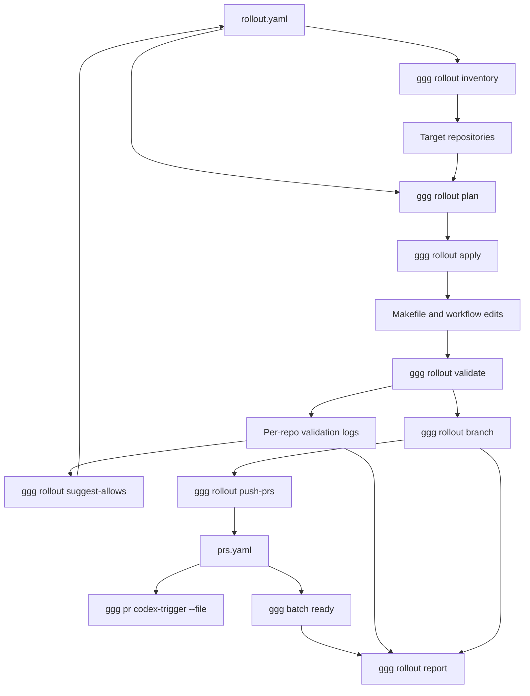

# ggg rollout automation improvements design

## Executive summary

The Glazed lint rollout showed that `ggg` already solves the PR-readiness portion of a multi-repository rollout, but it does not yet manage the work that happens before PR creation. The missing steps were implemented as ticket-local scripts under `INFRA-002`: repository inventory, target-list selection, Makefile/CI patching, Makefile repair scripts, validation runners, legacy allow-path generation, branch-base checks, PR creation, and no-verify push recovery. Those scripts are useful evidence. They also define the next layer of `ggg`.

The next `ggg` improvement should introduce a `rollout` command group with typed subcommands for repository inventory, target selection, patch planning, validation, branch hygiene, PR creation, readiness monitoring, and report generation. The goal is not to make rollouts fully automatic. The goal is to make rollouts explicit, reproducible, reviewable, and safe. A future operator should need one YAML rollout file and a small number of `ggg rollout ...` commands instead of hand-written Python and shell scripts for every ticket.

The design in this document is based on the actual INFRA-002 work. It explains the current manual workflow, the missing abstractions, proposed commands, data models, implementation phases, and testing strategy. It is written for an intern who needs to understand both the existing `ggg` code and the operational workflow before implementing the next set of commands.

## 1. What happened during INFRA-002

INFRA-002 rolled out Glazed CLI policy linting across the active xgoja workspace:

```text
/home/manuel/workspaces/2026-05-24/add-js-providers
```

The target repositories were:

```text
css-visual-diff
discord-bot
geppetto
glazed
go-go-goja
goja-git
go-minitrace
loupedeck
pinocchio
workspace-manager
```

The initial prompt looked simple: apply the Glazed linting playbook to the repositories in the workspace, push PRs, and wait for them to pass. The actual workflow required eleven scripts:

| Script | Purpose |
| --- | --- |
| `01-inventory-glazed-repos.sh` | Discover local repositories that depend on Glazed and record metadata. |
| `02-active-workspace-targets.txt` | Store the final explicit target set. |
| `03-apply-glazed-lint-wiring.py` | Edit Makefiles and lint workflows. |
| `04-normalize-glazed-lint-makefiles.py` | Repair generated Makefile details after the first pass. |
| `05-fix-glazed-lint-build-continuations.py` | Fix collapsed Makefile shell continuations. |
| `06-run-glazed-lint.sh` | Run `make glazed-lint` in every target and collect logs. |
| `07-apply-glazed-lint-fixes.py` | Add fallback linter install behavior and first allow paths. |
| `08-allow-legacy-glazed-lint-paths.py` | Add narrow legacy allow paths from analyzer diagnostics. |
| `09-commit-workspace-repos.sh` | Create rollout branches and commit focused files. |
| `10-push-and-open-prs.sh` | Push branches and open PRs with normal hooks. |
| `11-push-and-open-prs-no-verify.sh` | Push branches and open PRs without local pre-push hooks after a hook failure. |

The final `ggg` usage began only after the PRs existed:

```bash
ggg pr codex-trigger --file scripts/10-glazed-lint-prs.yaml
ggg batch ready scripts/10-glazed-lint-prs.yaml --output json
```

That is the core observation. `ggg` currently helps once the rollout has PRs. It should also help create the target list, plan edits, run validation, protect branch hygiene, and generate the PR list.

## 2. Current ggg capabilities

The existing `ggg` implementation has these relevant commands:

```text
ggg pr ready <pr>
ggg pr ready <pr> --findings
ggg pr codex-trigger <pr>
ggg pr codex-trigger --file prs.yaml
ggg pr codex-comments <pr>
ggg batch ready prs.yaml
ggg batch ready prs.yaml --watch
ggg release tag-patch|tag-minor|tag-major
```

The important packages are:

| Package | Current role |
| --- | --- |
| `pkg/prref` | Parse PR URLs and `owner/repo#number` references. |
| `pkg/prlist` | Load YAML PR lists. |
| `pkg/ghclient` | Use `gh` for GraphQL PR snapshots and PR comments. |
| `pkg/prready` | Classify PR snapshots into readiness states. |
| `pkg/release` | Plan and push release tags. |
| `internal/cli/pr` | Expose PR commands as Glazed commands. |
| `internal/cli/batch` | Expose batch readiness. |
| `internal/cli/release` | Expose release tag commands. |

These pieces should not be replaced. The rollout layer should call them. The new design should add a layer above PR readiness, not duplicate PR readiness.

## 3. The missing abstractions

The INFRA-002 scripts reveal eight missing abstractions.

### 3.1 Repository inventory

A rollout starts by asking: which local repositories are relevant? During INFRA-002, the inventory script reported:

- path;
- module path;
- Glazed version;
- whether a Makefile exists;
- lint target names;
- workflow presence;
- lefthook presence;
- package layout;
- git cleanliness.

This should be a typed `ggg` command rather than a shell script.

### 3.2 Target-set selection

Inventory is broader than intent. The first scan found many Glazed-dependent repositories, but the user clarified that the target set was only the active workspace. That decision became `02-active-workspace-targets.txt`. A future rollout should store target sets as YAML with explicit inclusion and exclusion reasons.

### 3.3 Patch planning

INFRA-002 needed to add Makefile variables, targets, lint target integration, and CI workflow steps. This is not a one-off string replacement. It is a patch plan derived from repository facts. The plan should be inspectable before mutation.

### 3.4 Validation execution

`make glazed-lint` had to run in every repo and produce per-repo logs. That is a reusable operation: run one or more commands across a target set, continue after failures, collect logs, and return a summary.

### 3.5 Diagnostic-driven remediation

The first validation pass found two classes of failure:

1. installation failures because older Glazed versions did not contain `cmd/tools/glazed-lint`;
2. analyzer diagnostics for existing legacy raw Cobra/env code.

The remediation was policy-driven. The linter install target got a fallback to `@latest`. Analyzer diagnostics were mapped to narrow allow paths. A future `ggg` command should not silently edit these paths, but it can propose a structured allow-path plan.

### 3.6 Branch hygiene

The first local commits were not all safe PR branches. `go-go-goja` and `loupedeck` had old xgoja release-train commits in their history. The repair was to rebase the single lint commit onto `origin/main` and verify every branch was exactly one commit ahead.

This check should be built into `ggg rollout status` and `ggg rollout push-prs`.

### 3.7 PR creation

After validation and branch hygiene, the workflow pushed branches and created PRs. That produced `scripts/10-glazed-lint-prs.yaml`, which is exactly the file format `ggg batch ready` already knows. PR creation should produce that file directly.

### 3.8 Rollout reporting and diary support

The rollout diary needed a lot of manual backfill. A future `ggg rollout report` command should generate a Markdown section from run state: target repos, commands run, logs, failures, PRs, readiness, and next steps. It should not replace human narrative, but it should prevent loss of factual detail.

## 4. Proposed command group

Add a top-level command group:

```text
ggg rollout
```

The command group should focus on multi-repository operational state. It should not be Glazed-lint-specific. Glazed linting becomes one rollout profile.

Proposed commands:

```text
ggg rollout inventory
ggg rollout init
ggg rollout plan
ggg rollout apply
ggg rollout validate
ggg rollout branch
ggg rollout push-prs
ggg rollout status
ggg rollout report
ggg rollout release-plan
```

Each command should emit Glazed rows. Every mutating command should support `--dry-run`. Commands that push, create PRs, or tag should require `--yes` unless they are dry-run-only.

## 5. Rollout YAML file

The central input should be a rollout YAML file. It should combine target repositories, patch profile, validation commands, PR behavior, and release behavior.

Example:

```yaml
id: INFRA-002
name: glazed-lint-rollout
workspace: /home/manuel/workspaces/2026-05-24/add-js-providers
branch: infra-002/glazed-lint
base: origin/main
commit_message: Run Glazed CLI policy linting

selection:
  require_go_mod_contains:
    - github.com/go-go-golems/glazed
  include:
    - css-visual-diff
    - discord-bot
    - geppetto
    - glazed
    - go-go-goja
    - goja-git
    - go-minitrace
    - loupedeck
    - pinocchio
    - workspace-manager
  exclude:
    - repo: infra-tooling
      reason: tooling repo, not rollout target

patches:
  - type: glazed-lint-makefile
    linter_package: github.com/go-go-golems/glazed/cmd/tools/glazed-lint
    fallback_version: latest
    package_dirs: auto
    allow_paths:
      css-visual-diff:
        - cmd/build-web/
        - cmd/css-visual-diff/
        - internal/cssvisualdiff/driver/
        - internal/cssvisualdiff/verbcli/bootstrap.go
      workspace-manager:
        - pkg/wsm/branch/

validation:
  commands:
    - name: glazed-lint
      run: make glazed-lint
  continue_on_error: true
  log_dir: ttmp/2026/05/27/INFRA-002--roll-out-glazed-cli-policy-linting-across-go-go-golems-repositories/sources/rollout-logs

pull_request:
  title: Run Glazed CLI policy linting
  body_file: ttmp/2026/05/27/INFRA-002--roll-out-glazed-cli-policy-linting-across-go-go-golems-repositories/scripts/10-pr-body.md
  output_prs: ttmp/2026/05/27/INFRA-002--roll-out-glazed-cli-policy-linting-across-go-go-golems-repositories/scripts/10-glazed-lint-prs.yaml
  no_verify_push: false

readiness:
  trigger_codex: true
  watch: false

release:
  mode: tag-patch
  require_manual_approval: true
```

This file should be editable by humans. It should not hide policy in command-line flags or generated scripts.

## 6. Data model

Add a new package:

```text
pkg/rollout
```

Core types:

```go
type Config struct {
    ID            string
    Name          string
    Workspace     string
    Branch        string
    Base          string
    CommitMessage string
    Selection     Selection
    Patches       []Patch
    Validation    Validation
    PullRequest   PullRequest
    Readiness     Readiness
    Release       Release
}

type Repo struct {
    Name           string
    Path           string
    Module         string
    GlazedVersion  string
    HasMakefile    bool
    LintTargets    []string
    HasWorkflows   bool
    HasLefthook    bool
    PackageDirs    []string
    GitStatus      GitStatus
    CurrentBranch  string
    AheadBase      int
    DirtyTracked   bool
    DirtyUntracked bool
}

type PatchPlan struct {
    Repo       Repo
    Operations []PatchOperation
    Warnings   []string
}

type PatchOperation struct {
    File        string
    Kind        string
    Description string
    DryRunDiff  string
}

type ValidationResult struct {
    Repo     Repo
    Command  string
    ExitCode int
    LogPath  string
    OK       bool
}

type PRResult struct {
    Repo   Repo
    URL    string
    Number int
    State  string
}
```

The design should keep repository facts, patch plans, validation results, and PR results as separate structures. That makes the implementation testable and lets commands share data.

## 7. Command behavior in detail

### 7.1 `ggg rollout inventory`

Purpose: replace `01-inventory-glazed-repos.sh`.

Example:

```bash
ggg rollout inventory \
  --root /home/manuel/workspaces/2026-05-24/add-js-providers \
  --require-module github.com/go-go-golems/glazed \
  --output yaml
```

Rows:

```text
repo_path | module | glazed_version | has_makefile | lint_targets | has_workflows | has_lefthook | package_dirs | git_status
```

Implementation outline:

```go
func Inventory(root string, filters Filters) ([]rollout.Repo, error) {
    gomods := findGoMods(root)
    repos := []Repo{}
    for _, gomod := range gomods {
        mod := parseGoMod(gomod)
        if !filters.Match(mod) { continue }
        repo := inspectRepo(filepath.Dir(gomod), mod)
        repos = append(repos, repo)
    }
    return repos, nil
}
```

Important details:

- Use `golang.org/x/mod/modfile` rather than parsing `go.mod` with ad-hoc regex where practical.
- Report duplicate module paths if multiple checkouts are found.
- Report dirty tracked and untracked state separately.

### 7.2 `ggg rollout init`

Purpose: create a rollout YAML from inventory and explicit includes.

Example:

```bash
ggg rollout init \
  --id INFRA-002 \
  --workspace /home/manuel/workspaces/2026-05-24/add-js-providers \
  --include css-visual-diff,discord-bot,geppetto,glazed,go-go-goja,goja-git,go-minitrace,loupedeck,pinocchio,workspace-manager \
  --profile glazed-lint \
  --output-file ttmp/.../scripts/rollout.yaml
```

This command should not modify target repositories. It creates the configuration file that future commands read.

### 7.3 `ggg rollout plan`

Purpose: compute what would change, without writing files.

Example:

```bash
ggg rollout plan ttmp/.../scripts/rollout.yaml --output markdown
```

Rows:

```text
repo | file | operation | description | warning
```

For Glazed linting, the planner should detect:

- whether `GLAZED_LINT_BIN` variables exist;
- whether `glazed-lint-build` exists;
- whether `glazed-lint` exists;
- whether `lint` and `lintmax` call the vettool;
- whether `.github/workflows/lint.yml` has the `Run Glazed CLI policy linters` step;
- whether package dirs should be `$(LINT_DIRS)` or auto-detected dirs.

The planner should also warn when a repo has:

- detached HEAD;
- more than one commit ahead of base;
- dirty tracked files;
- no Makefile;
- no lint workflow;
- old Glazed version that likely needs linter install fallback.

### 7.4 `ggg rollout apply`

Purpose: apply the planned file changes.

Example:

```bash
ggg rollout apply ttmp/.../scripts/rollout.yaml --yes
```

Safety rules:

- Refuse dirty tracked worktrees unless `--allow-dirty` is set.
- Refuse to edit a repo not listed in the rollout YAML.
- Write a per-repo patch summary.
- Support `--dry-run` to print diffs without writing.

Implementation outline:

```go
func Apply(config Config, opts ApplyOptions) ([]PatchResult, error) {
    repos := ResolveTargets(config)
    for _, repo := range repos {
        plan := PlanRepo(config, repo)
        if opts.DryRun { emit(plan); continue }
        if repo.DirtyTracked && !opts.AllowDirty { return error }
        for _, op := range plan.Operations { op.Apply() }
    }
}
```

### 7.5 `ggg rollout validate`

Purpose: replace `06-run-glazed-lint.sh` and generalize it.

Example:

```bash
ggg rollout validate ttmp/.../scripts/rollout.yaml --output json
```

Behavior:

- Run each configured validation command in each target repo.
- Continue after failures if configured.
- Store one log per repo/command.
- Emit rows with repo, command, exit code, OK, and log path.
- Return non-zero if any required validation failed.

Pseudocode:

```go
func Validate(config Config) []ValidationResult {
    for repo in targets {
        for cmd in config.Validation.Commands {
            logPath := logPath(config, repo, cmd)
            code := runCommand(repo.Path, cmd.Run, logPath)
            results = append(results, ValidationResult{Repo: repo, Command: cmd.Name, ExitCode: code, LogPath: logPath, OK: code == 0})
        }
    }
    return results
}
```

A later extension can parse diagnostics and produce suggested allow paths, but the first implementation should only run commands and store logs.

### 7.6 `ggg rollout branch`

Purpose: create or verify clean one-commit rollout branches.

Example:

```bash
ggg rollout branch ttmp/.../scripts/rollout.yaml --commit --yes
```

Sub-behaviors:

```text
ggg rollout branch --status       # inspect branch/base state
ggg rollout branch --create       # create/reset branch from current worktree
ggg rollout branch --commit       # stage configured files and commit
ggg rollout branch --rebase-one   # rebase the top commit onto origin/main if safe
```

The branch command should encode the repair that INFRA-002 needed for `go-go-goja` and `loupedeck`: check `origin/main..HEAD` and stop if the future PR branch includes unrelated history.

Rules:

- Refuse to commit unconfigured files.
- Refuse if staged files include unexpected paths.
- Warn about untracked files but do not stage them.
- Verify final `rev-list --count base..HEAD` if `expected_ahead: 1` is configured.

### 7.7 `ggg rollout push-prs`

Purpose: replace `10-push-and-open-prs.sh` and `11-push-and-open-prs-no-verify.sh`.

Example:

```bash
ggg rollout push-prs ttmp/.../scripts/rollout.yaml --yes
```

Options:

```text
--no-verify-push       bypass local pre-push hooks
--open-only            create PRs for already-pushed branches
--push-only            push branches without opening PRs
--output-prs FILE      write ggg batch-ready compatible PR YAML
```

Safety rules:

- Do not merge.
- Verify branch name and ahead count before pushing.
- Require `--yes` for actual push/PR creation.
- Store the output PR YAML in the rollout config path.

The no-verify option should be explicit and should record a reason:

```bash
ggg rollout push-prs rollout.yaml --no-verify-push --reason "css-visual-diff pre-push hook runs unrelated snapshot release and hit flaky local test" --yes
```

### 7.8 `ggg rollout status`

Purpose: combine local branch state and remote PR readiness.

Example:

```bash
ggg rollout status ttmp/.../scripts/rollout.yaml --output table
```

Rows:

```text
repo | local_branch | ahead_base | dirty | pr | readiness_state | terminal | checks | codex
```

This command should call existing `prready`/`ghclient` code when PRs exist. It should not duplicate `ggg batch ready`; it should enrich it with local branch state and rollout config.

### 7.9 `ggg rollout report`

Purpose: generate Markdown for docmgr diary/changelog handoff.

Example:

```bash
ggg rollout report ttmp/.../scripts/rollout.yaml --format markdown --output-file ttmp/.../sources/rollout-report.md
```

The report should include:

- target repositories;
- patch summary;
- validation commands and logs;
- commits;
- PR URLs;
- readiness summary;
- failures and next actions.

This does not replace the diary. It gives the diary factual scaffolding.

## 8. Glazed lint profile

The first concrete profile should be `glazed-lint`. It can live in code first and later become data-driven.

Responsibilities:

- Add `GLAZED_LINT_BIN`, `GLAZED_LINT_PKG`, `GLAZED_VERSION`, `GLAZED_LINT_FLAGS`, and `GLAZED_LINT_DIRS` when missing.
- Add `glazed-lint-build` with fallback install behavior.
- Add `glazed-lint` target.
- Wire `lint` and `lintmax` to build and run the vettool.
- Add CI step after golangci-lint in `.github/workflows/lint.yml` when present.
- Preserve existing custom lint tools.
- Prefer `$(LINT_DIRS)` when a repo already computes it.
- Auto-detect package dirs otherwise.

The fallback install behavior should be the default because older repos may depend on Glazed versions that predate the linter package:

```make
GOBIN=$(dir $(GLAZED_LINT_BIN)) GOWORK=off go install $(GLAZED_LINT_PKG)@$(GLAZED_VERSION) || \
	GOBIN=$(dir $(GLAZED_LINT_BIN)) GOWORK=off go install $(GLAZED_LINT_PKG)@latest
```

The profile should also allow explicit allow paths in YAML. It should not infer and apply allow paths silently.

## 9. Diagnostic parser for allow-path suggestions

A future command can parse `make glazed-lint` logs and suggest allow paths:

```bash
ggg rollout suggest-allows ttmp/.../scripts/rollout.yaml --from-logs sources/glazed-lint-logs
```

Output rows:

```text
repo | diagnostic_kind | path | suggested_allow_path | count | sample_message
```

Rules:

- Suggest paths; do not apply them automatically unless `--yes` is provided.
- Prefer file-level or narrow directory-level suggestions.
- Group repeated raw flag diagnostics under the nearest command package directory.
- Group env diagnostics under the smallest stable legacy package path.
- Mark suggestions as `legacy_allow` so reviewers know they are not fixes.

Example from INFRA-002:

| Repo | Diagnostic | Suggested allow path |
| --- | --- | --- |
| `css-visual-diff` | raw Cobra flags in main CLI | `cmd/css-visual-diff/` |
| `go-minitrace` | legacy annotate raw flags | `cmd/go-minitrace/cmds/annotate/` |
| `loupedeck` | example command raw flags | `examples/cmd/` |
| `workspace-manager` | env lookup in branch package | `pkg/wsm/branch/` |

This should be a review aid, not an excuse to hide new violations.

## 10. Integration with existing ggg PR readiness

Rollout PR creation should produce the same YAML shape that `ggg pr codex-trigger --file` and `ggg batch ready` already accept:

```yaml
prs:
  - https://github.com/go-go-golems/css-visual-diff/pull/9
  - https://github.com/go-go-golems/discord-bot/pull/10
```

The rollout config can reference that file:

```yaml
pull_request:
  output_prs: scripts/10-glazed-lint-prs.yaml
```

Then existing commands remain valid:

```bash
ggg pr codex-trigger --file scripts/10-glazed-lint-prs.yaml
ggg batch ready scripts/10-glazed-lint-prs.yaml --watch
```

A later `ggg rollout status` can call the same package-level APIs directly rather than shelling out to `ggg batch ready`.

## 11. Architecture diagram



The key structure is that rollout commands produce files and rows that existing PR commands can already consume.

## 12. Implementation phases

### Phase 1: Inventory and config

Implement:

```text
ggg rollout inventory
ggg rollout init
```

Files:

```text
internal/cli/rollout/root.go
internal/cli/rollout/inventory.go
internal/cli/rollout/init.go
pkg/rollout/config.go
pkg/rollout/inventory.go
```

Tests:

- temp directories with `go.mod` files;
- duplicate module paths;
- dirty vs clean git repos;
- Makefile target detection;
- workflow detection.

### Phase 2: Glazed lint patch planner

Implement:

```text
ggg rollout plan --profile glazed-lint
ggg rollout apply --profile glazed-lint
```

Files:

```text
pkg/rollout/patch.go
pkg/rollout/glazedlint/profile.go
pkg/rollout/glazedlint/makefile.go
pkg/rollout/glazedlint/workflow.go
internal/cli/rollout/plan.go
internal/cli/rollout/apply.go
```

Tests:

- Makefile without targets;
- Makefile with `LINT_DIRS`;
- Makefile with custom lint tools;
- already-wired Makefile idempotence;
- lint workflow insertion after golangci-lint action;
- dry-run diff output.

### Phase 3: Validation runner

Implement:

```text
ggg rollout validate
```

Files:

```text
pkg/rollout/validate.go
internal/cli/rollout/validate.go
```

Tests:

- command success/failure;
- continue-on-error behavior;
- log path creation;
- exit code summary.

### Phase 4: Branch hygiene and commit

Implement:

```text
ggg rollout branch --status
ggg rollout branch --commit
ggg rollout branch --rebase-one
```

Files:

```text
pkg/rollout/git.go
pkg/rollout/branch.go
internal/cli/rollout/branch.go
```

Tests:

- temporary git repos;
- detached HEAD;
- one commit ahead;
- many commits ahead;
- dirty tracked files;
- untracked ignored artifacts;
- staged unexpected files.

### Phase 5: PR creation

Implement:

```text
ggg rollout push-prs
```

Files:

```text
pkg/rollout/prs.go
internal/cli/rollout/push_prs.go
```

Tests:

- fake GitHub client interface;
- branch push plan dry-run;
- PR YAML output;
- no-verify reason requirement.

### Phase 6: Rollout status and report

Implement:

```text
ggg rollout status
ggg rollout report
```

Files:

```text
pkg/rollout/status.go
pkg/rollout/report.go
internal/cli/rollout/status.go
internal/cli/rollout/report.go
```

Tests:

- combine local branch state with PR readiness fixtures;
- Markdown report generation;
- partial readiness reporting;
- terminal failure reporting.

## 13. API and file references

Existing code to reuse:

| File | Use |
| --- | --- |
| `cmd/ggg/main.go` | Existing root entry point and exit-code handling. |
| `internal/cli/root.go` | Register new `rollout` command group here. |
| `internal/cli/pr/codex_trigger.go` | Reuse Codex trigger behavior and skip policy. |
| `internal/cli/batch/ready.go` | Reuse batch readiness semantics. |
| `internal/cli/release/tag.go` | Reuse release tag option patterns. |
| `pkg/prlist/prlist.go` | Reuse/write PR list YAML. |
| `pkg/prready/prready.go` | Reuse readiness state model. |
| `pkg/ghclient/readiness.go` | Reuse GitHub PR snapshot and readiness collection. |
| `internal/exitcode/exitcode.go` | Reuse requested-exit-code pattern for commands that emit rows and still need process status. |

Ticket evidence to model:

| File | Lesson |
| --- | --- |
| `scripts/01-inventory-glazed-repos.sh` | Inventory fields and duplicate checkout problem. |
| `scripts/03-apply-glazed-lint-wiring.py` | Makefile/workflow patch operations. |
| `scripts/06-run-glazed-lint.sh` | Validation runner behavior and log layout. |
| `scripts/08-allow-legacy-glazed-lint-paths.py` | Diagnostic-to-allow-path workflow. |
| `scripts/09-commit-workspace-repos.sh` | Focused staging and commit behavior. |
| `scripts/10-push-and-open-prs.sh` | PR creation and PR YAML output. |
| `scripts/11-push-and-open-prs-no-verify.sh` | Need for explicit no-verify push mode with reason. |

## 14. Design decisions

### 14.1 Use a rollout YAML file as the durable state boundary

The rollout YAML should be the source of truth for target repositories and policy. Command-line flags are useful for overrides, but a multi-repository rollout needs a file that can be committed, reviewed, and resumed.

### 14.2 Keep patch profiles separate from rollout mechanics

`glazed-lint` is one profile. Future profiles may handle logcopter, docsctl publishing, dependency bumping, or xgoja provider support. The rollout engine should know about repositories, validation, branches, PRs, and reports. A profile should know how to edit files for a specific policy.

### 14.3 Require dry-run and confirmation for mutation

Inventory and planning are read-only. Apply, commit, push, PR creation, and release are mutating. They should support dry-run and require `--yes` for non-dry-run operation.

### 14.4 Preserve row-oriented output

Every command should emit rows. This keeps `ggg` consistent and makes rollout state scriptable:

```bash
ggg rollout status rollout.yaml --output json | jq '.[] | select(.state != "ready")'
```

### 14.5 Do not merge in rollout automation

The current user policy is explicit: open PRs, wait until they pass, then report so the user can review. `ggg rollout` can report readiness and release plans, but merge should remain manual unless a future ticket explicitly authorizes merge automation.

## 15. Risks and mitigations

| Risk | Mitigation |
| --- | --- |
| The patcher edits unintended repositories. | Require explicit target list in rollout YAML and refuse repos outside it. |
| The patcher stages unrelated files. | Stage only configured paths and report untracked files separately. |
| Branches include stale rollout history. | Check `rev-list --count base..HEAD` and refuse unexpected ahead counts. |
| Local hooks block branch publication with unrelated work. | Support explicit `--no-verify-push --reason`, while preserving CI/`ggg` readiness as merge gate. |
| Allow paths hide real issues. | Generate suggestions only; require review; prefer narrow paths; include logs and counts. |
| Old dependency versions lack tooling packages. | Use fallback install behavior or enforce a minimum tool version. |
| Command output becomes too human-only. | Keep all commands Glazed row commands with `--output json`. |

## 16. Recommended first implementation slice

The first useful slice should not implement all of rollout automation. It should implement the discovery and validation parts because they are low-risk and immediately useful.

Recommended first PR:

```text
ggg rollout inventory
ggg rollout validate
```

Why this slice first:

- It does not mutate target repositories.
- It replaces two scripts from INFRA-002.
- It establishes `pkg/rollout` data types.
- It creates testable building blocks for later patch and PR commands.

Second PR:

```text
ggg rollout plan --profile glazed-lint
ggg rollout apply --profile glazed-lint --dry-run
```

Third PR:

```text
ggg rollout branch
ggg rollout push-prs
```

Fourth PR:

```text
ggg rollout status
ggg rollout report
```

This sequence keeps mutation behind well-tested read-only commands.

## 17. How an intern should start

Start by reading these files:

```text
cmd/ggg/main.go
internal/cli/root.go
internal/cli/batch/ready.go
pkg/prlist/prlist.go
pkg/prready/prready.go
pkg/ghclient/readiness.go
ttmp/2026/05/27/INFRA-002--roll-out-glazed-cli-policy-linting-across-go-go-golems-repositories/reference/01-glazed-linting-rollout-diary.md
```

Then implement `pkg/rollout.Repo` and an inventory function. Write tests with temporary directories and minimal `go.mod` files. Only after inventory is tested should you add Cobra/Glazed command wiring.

A minimal inventory command can be implemented before any patch profile exists. It only needs to answer the question: what repositories are present, and what facts do we know about them?

## 18. Closing recommendation

`ggg` should become the tool that converts an operator's rollout intent into auditable steps. The next layer should not hide complexity. It should expose repository facts, patch plans, validation logs, branch state, PR URLs, and readiness summaries as structured rows. That is what was missing during INFRA-002.

The highest-value improvements are:

1. `ggg rollout inventory` for repository discovery.
2. `ggg rollout validate` for cross-repo command execution and logs.
3. `ggg rollout branch --status` for clean PR branch guarantees.
4. `ggg rollout push-prs` for PR creation and PR YAML output.
5. `ggg rollout report` for diary and review handoff.

Once these exist, future rollouts should require fewer ticket-local scripts, fewer manual branch audits, and less diary backfill. The operator will still make the decisions. `ggg` will preserve the evidence and make the safe path easier to follow.
