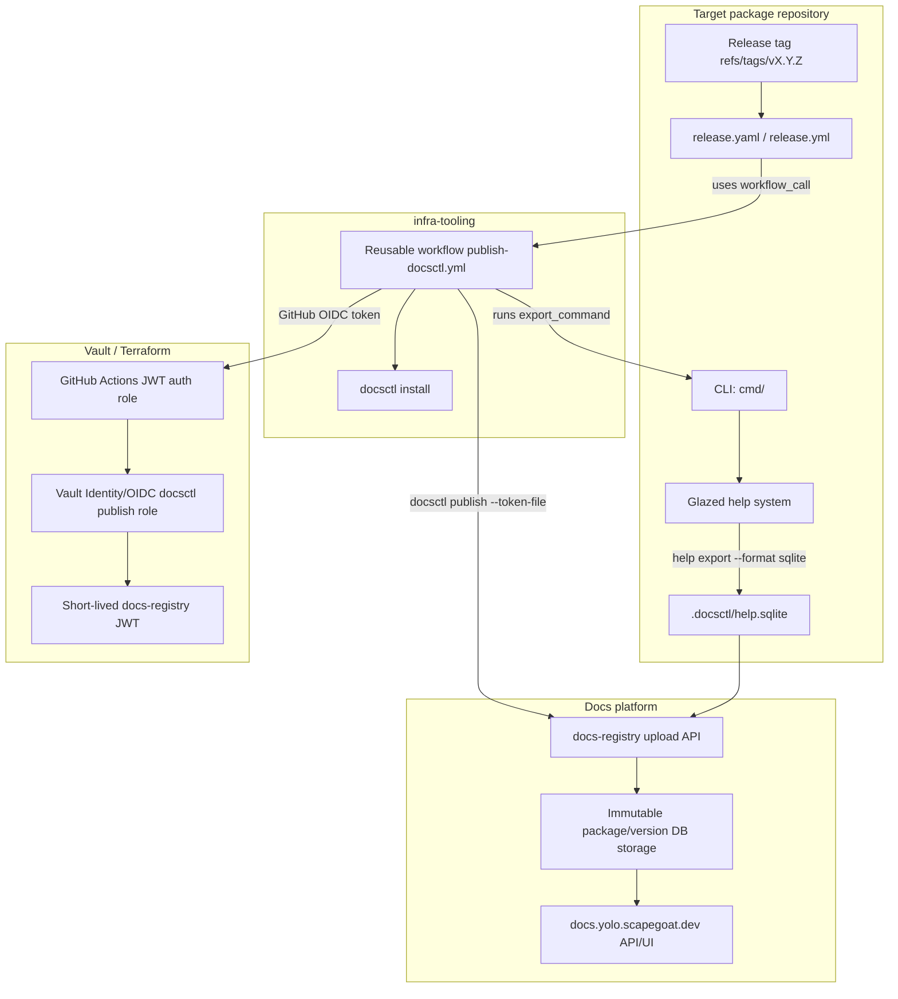
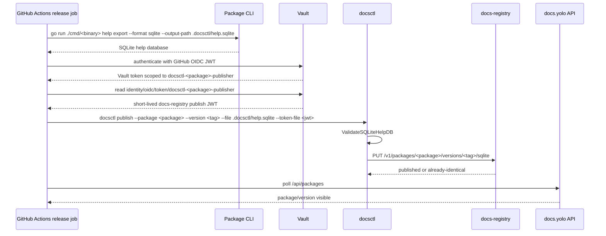

# Docsctl Publishing Rollout Analysis and Implementation Guide

## Executive summary

This document explains how to add `docsctl` documentation publishing to Go-Go-Golems packages that already expose a Glazed CLI help tree capable of exporting a SQLite database. The goal is to make each approved package publish versioned help documentation to `https://docs.yolo.scapegoat.dev/<package>/<version>` whenever a GitHub release tag is pushed.

The rollout is not just a workflow edit. It crosses several systems:

- the package CLI must wire Glazed's help system and produce a non-empty SQLite export;
- the package release workflow must call the reusable `infra-tooling` workflow after release artifacts are built;
- GitHub Actions must have `id-token: write` permission so it can authenticate to Vault using OIDC;
- Terraform/Vault must define a package-scoped publisher role;
- Vault must mint a short-lived docs-registry publish JWT with a package claim;
- `docsctl publish` must validate and upload the SQLite database to the docs registry;
- the public docs API must show the new package/version after release.

The inventory in this ticket found six clear new rollout candidates in the active workspace:

| Package | Export command | Local export | `docsctl validate` | Recommendation |
|---|---|---:|---:|---|
| `css-visual-diff` | `go run ./cmd/css-visual-diff help export --format sqlite --output-path .docsctl/help.sqlite` | yes | yes | Add Vault role + release workflow job. |
| `discord-bot` | `go run ./cmd/discord-bot help export --format sqlite --output-path .docsctl/help.sqlite` | yes | yes | Add Vault role + release workflow job. |
| `go-minitrace` | `go run ./cmd/go-minitrace help export --format sqlite --output-path .docsctl/help.sqlite` | yes | yes | Add Vault role + release workflow job. |
| `loupedeck` | `go run ./cmd/loupedeck help export --format sqlite --output-path .docsctl/help.sqlite` | yes | yes | Add Vault role + release workflow job. |
| `workspace-manager` | `go run ./cmd/wsm help export --format sqlite --output-path .docsctl/help.sqlite` | yes | yes | Add Vault role + release workflow job using package name `workspace-manager`. |
| `go-go-goja` | `go run ./cmd/goja-repl help export --format sqlite --output-path .docsctl/help.sqlite` | yes | yes | Add Vault role + release workflow job using `goja-repl` as the canonical export command for package `go-go-goja`. |

Two packages are special cases:

- `glazed` already has a `publish-docs` job in its release workflow and is already visible in the public docs API.
- `pinocchio` is already visible in the public docs API and has an existing Vault publisher role, but the local workspace release workflow should still be audited before assuming no action is needed. Its `cmd/web-chat` helper exports an SQLite file but validation fails because it has no sections, so it is not a publish candidate as-is.

`geppetto` and `goja-git` are not candidates from this pass: `geppetto` has no `cmd/*/main.go` in the simple inventory shape, and `goja-git` only exposed `cmd/XXX`, which did not produce a useful help SQLite artifact.

## Problem statement and scope

The Go-Go-Golems packages now have improved release-train automation through `ggg`, but docs publication still requires per-package setup. The existing `docsctl` publishing playbook describes how to wire an individual package, but we need a rollout plan that identifies which packages are actually ready and explains the entire system well enough for a new intern to implement the rollout safely.

This document covers:

1. how the docs publishing architecture works;
2. how to identify packages that can publish;
3. which active workspace packages are ready now;
4. what release workflow and Terraform/Vault changes are required;
5. how to validate the rollout locally and in GitHub Actions;
6. how to use `ggg` for PR readiness after changes are made;
7. what risks and open decisions must be handled before merging.

This document does **not** perform the rollout edits. It is the design and implementation guide for the follow-up rollout.

## Source evidence

The current `infra-tooling` playbook defines the target shape. It says a completed repository must export Glazed help as SQLite, have `id-token: write`, call the reusable workflow `go-go-golems/infra-tooling/.github/workflows/publish-docsctl.yml@main`, run only for release tags, pass `package_version: ${{ github.ref_name }}`, have a Vault role named `docsctl-<package>-publisher`, and appear in `https://docs.yolo.scapegoat.dev/api/packages` after release. Evidence: `/home/manuel/code/wesen/go-go-golems/infra-tooling/docs/go-go-golems/playbooks/docsctl-docs-publishing-rollout-playbook.md:31-47`.

The same playbook describes the end-to-end trust path: GitHub release tag → package release workflow → Glazed help SQLite export → GitHub OIDC token → Vault GitHub Actions JWT auth role → Vault Identity/OIDC docsctl publish JWT → `docsctl publish` → docs-registry → public docs site. Evidence: `/home/manuel/code/wesen/go-go-golems/infra-tooling/docs/go-go-golems/playbooks/docsctl-docs-publishing-rollout-playbook.md:62-83`.

The reusable workflow accepts the important inputs: `package_name`, `package_version`, `export_command`, `sqlite_path`, `docsctl_install_command`, registry URL, Vault settings, and verify settings. Evidence: `/home/manuel/code/wesen/go-go-golems/infra-tooling/.github/workflows/publish-docsctl.yml:3-59`.

The reusable workflow requires `contents: read` and `id-token: write`, installs `docsctl`, runs the export command, checks that the SQLite file exists, logs into Vault using `hashicorp/vault-action`, mints a docs-registry publish JWT, runs `docsctl publish`, and verifies public API visibility. Evidence: `/home/manuel/code/wesen/go-go-golems/infra-tooling/.github/workflows/publish-docsctl.yml:61-220`.

The Terraform/Vault workspace already models package-scoped docs publishers as `local.docsctl_publishers`. Existing examples are `glazed`, `pinocchio`, `remarquee`, and `sqleton`. Evidence: `/home/manuel/code/wesen/terraform/vault/github-actions/envs/k3s/main.tf:1-27`.

The Vault role mints a JWT with `token_use=docsctl-publish`, a package claim, repository metadata, workflow ref, job workflow ref, and run id. Evidence: `/home/manuel/code/wesen/terraform/vault/github-actions/envs/k3s/main.tf:75-94`.

The Vault GitHub Actions auth role binds claims tightly: owner, repository, repository id, tag ref, event name, package release workflow ref, and reusable job workflow ref. Evidence: `/home/manuel/code/wesen/terraform/vault/github-actions/envs/k3s/main.tf:122-155`.

The current `docsctl validate` command requires `--package`, `--version`, and `--file`. Evidence: `/home/manuel/workspaces/2026-05-24/add-js-providers/glazed/cmd/docsctl/validate.go:20-41`. This is an important correction to the current playbook examples, which still show `docsctl validate --file .docsctl/help.sqlite` without package/version flags.

`docsctl validate` checks the SQLite database read-only, requires a sections table and required columns, rejects empty section sets, rejects empty/duplicate slugs, and carries package/version options into validation. Evidence: `/home/manuel/workspaces/2026-05-24/add-js-providers/glazed/pkg/help/publish/sqlite_validator.go:31-95`.

`docsctl publish` validates locally before upload, constructs the target registry route `/v1/packages/<package>/versions/<version>/sqlite`, supports dry-run, resolves a token/token-file, and then uploads the SQLite bytes. Evidence: `/home/manuel/workspaces/2026-05-24/add-js-providers/glazed/cmd/docsctl/publish.go:67-90`.

## System model for a new intern

### Terms

- **Glazed help system:** The in-process documentation system used by Go-Go-Golems CLIs. A CLI creates a help system, loads markdown sections from embedded files, and wires a `help` command into the Cobra root.
- **Help SQLite export:** A SQLite database generated by `<binary> help export --format sqlite --output-path <path>`. It is the artifact that gets published.
- **`docsctl`:** The CLI shipped by `glazed` that validates and publishes help SQLite databases.
- **docs-registry:** The write-side service at `https://docs-registry.yolo.scapegoat.dev` that accepts package/version SQLite uploads.
- **docs.yolo:** The read-side public site/API at `https://docs.yolo.scapegoat.dev`.
- **GitHub OIDC:** GitHub Actions can request an identity token for the running workflow. Vault uses that token to prove which repo, workflow, ref, and event are running.
- **Vault publisher role:** A package-scoped Vault role named `docsctl-<package>-publisher` that lets exactly one repository/release workflow mint exactly one package's docs publish JWT.
- **`ggg`:** The infra-tooling management CLI used for PR creation/readiness/Codex/release train automation.

### Architecture diagram



### Sequence diagram



## Current package inventory

The ticket scripts generated evidence under:

```text
/home/manuel/code/wesen/go-go-golems/infra-tooling/ttmp/2026/05/27/INFRA-003--roll-out-docsctl-documentation-publishing-for-cli-packages/sources/help-export-inventory
```

The inventory command shape was (the generated SQLite files are intentionally ignored in git; the summary and validation logs are tracked):

```bash
GOWORK=off go run ./cmd/<binary> help export --format sqlite --output-path <ticket>/sources/help-export-inventory/sqlite/<repo>/<binary>/help.sqlite
```

The validation command shape was:

```bash
docsctl validate \
  --file <ticket>/sources/help-export-inventory/sqlite/<repo>/<binary>/help.sqlite \
  --package <package> \
  --version v0.0.0-inventory
```

The following table is the practical rollout inventory.

| Repository | CLI command | Export result | Validation result | SQLite size | Notes |
|---|---|---:|---:|---:|---|
| `css-visual-diff` | `./cmd/css-visual-diff` | ok | ok | 167936 bytes | Ready. `./cmd/build-web` is not a docs CLI. |
| `discord-bot` | `./cmd/discord-bot` | ok | ok | 118784 bytes | Ready. |
| `glazed` | `./cmd/glaze` | ok | ok | 729088 bytes | Already publishes; use as reference implementation. |
| `go-go-goja` | `./cmd/goja-jsdoc` | ok | ok | 61440 bytes | Valid export, but not selected for package-level publishing. |
| `go-go-goja` | `./cmd/goja-repl` | ok | ok | 278528 bytes | Selected canonical docs export for package `go-go-goja`. |
| `go-go-goja` | `./cmd/jsverbs-example` | ok | ok | 278528 bytes | Example binary; do not publish as canonical package docs. |
| `go-go-goja` | `./cmd/xgoja` | ok | ok | 114688 bytes | Valid export, but not selected for this rollout. |
| `go-minitrace` | `./cmd/go-minitrace` | ok | ok | 266240 bytes | Ready. |
| `loupedeck` | `./cmd/loupedeck` | ok | ok | 102400 bytes | Ready. |
| `pinocchio` | `./cmd/pinocchio` | ok | ok | 655360 bytes | Already published in docs API; audit workflow before editing. |
| `pinocchio` | `./cmd/web-chat` | ok | failed | 49152 bytes | Not a candidate: `docsctl validate` reports `help database contains no sections`. |
| `workspace-manager` | `./cmd/wsm` | ok | ok | 102400 bytes | Ready. Publish under package name `workspace-manager`. |

Current public docs packages from `https://docs.yolo.scapegoat.dev/api/packages` are:

| Package | Versions observed |
|---|---|
| `glazed` | `v1.3.5`, `v1.3.4`, `v1.3.3`, `v1.2.15` |
| `pinocchio` | `v0.10.26` |
| `remarquee` | `v0.0.7` |
| `sqleton` | `v0.4.4` |

Repository IDs captured through GitHub GraphQL for ready candidates:

| Repository | `databaseId` | Default branch |
|---|---:|---|
| `go-go-golems/css-visual-diff` | `1141501425` | `main` |
| `go-go-golems/discord-bot` | `1216566098` | `main` |
| `go-go-golems/glazed` | `565461475` | `main` |
| `go-go-golems/go-go-goja` | `1006302809` | `main` |
| `go-go-golems/go-minitrace` | `1198688064` | `main` |
| `go-go-golems/loupedeck` | `1208159764` | `main` |
| `go-go-golems/pinocchio` | `802670903` | `main` |
| `go-go-golems/workspace-manager` | `1002639882` | `main` |

## Candidate classification

### Tier 1: ready to roll out

These packages have a release workflow, a clear release binary, a valid SQLite help export, and no obvious package naming ambiguity:

1. `css-visual-diff`
2. `discord-bot`
3. `go-minitrace`
4. `loupedeck`

For each Tier 1 package, the implementation is mostly mechanical:

- add a `docsctl_<package>_publisher` entry to Terraform `local.docsctl_publishers`;
- apply Terraform after review;
- add `id-token: write` to the package release workflow permissions;
- add a `publish-docs` job after `goreleaser-merge`;
- validate locally;
- open PR;
- use `ggg pr ready` / `ggg pr watch` to wait for checks and Codex.

### Tier 2: now approved after package-scope decisions

`workspace-manager` exports valid docs through `./cmd/wsm`. The approved public docs package name is `workspace-manager`, not `wsm`. The resulting docs URL shape is:

```text
https://docs.yolo.scapegoat.dev/workspace-manager/<version>
```

The Terraform role and workflow inputs should therefore use `docsctl-workspace-manager-publisher` and `package_name: workspace-manager`.

`go-go-goja` has several valid help-exporting binaries. The approved canonical docs export for this rollout is `goja-repl`, published under package name `go-go-goja`. The resulting docs URL shape is:

```text
https://docs.yolo.scapegoat.dev/go-go-goja/<version>
```

Do not publish `jsverbs-example` as public package docs; it is an example binary. Do not use `xgoja` or `goja-jsdoc` for this package-level rollout unless the product decision changes later.

### Tier 3: already live / audit only

`glazed` already has a release workflow `publish-docs` job and is visible in the public docs API. Use it as the canonical workflow shape.

`pinocchio` is visible in the public docs API and already has a Vault role in Terraform. However, the local workspace release workflow did not show a `publish-docs` job in the quick grep. Before changing anything, check the current default branch after the recent merges. If the job is absent, add only the workflow job; do not add a duplicate Vault role.

### Tier 4: not candidates from this pass

`geppetto` was not detected by the simple `cmd/*/main.go` inventory. It may still have CLIs under deeper example/tool paths, but it is not a straightforward release-package docs candidate.

`goja-git` only showed `./cmd/XXX`, and that command did not emit a useful SQLite help database. It should not receive docs publishing until the CLI/release shape is cleaned up.

`pinocchio ./cmd/web-chat` exports a SQLite file but validation fails with `help database contains no sections`. A publish workflow should never upload that artifact.

## Implementation guide

### Phase 0: prepare the operator environment

Install or verify the tools:

```bash
gh --version
go version
docsctl --help || go install github.com/go-go-golems/glazed/cmd/docsctl@latest
terraform version
remarquee status
```

Use `GOWORK=off` for package-local validation to mimic CI module mode and avoid accidentally using a workspace checkout:

```bash
GOWORK=off go run ./cmd/<binary> help export --format sqlite --output-path .docsctl/help.sqlite
```

### Phase 1: prove export and validation before editing workflows

For each candidate repository:

```bash
cd /home/manuel/workspaces/2026-05-24/add-js-providers/<repo>
rm -rf .docsctl
mkdir -p .docsctl
GOWORK=off go run ./cmd/<binary> help export --format sqlite --output-path .docsctl/help.sqlite
test -s .docsctl/help.sqlite
docsctl validate --file .docsctl/help.sqlite --package <package> --version v0.0.0-local
rm -rf .docsctl
```

Important details:

- The current playbook examples should be updated to pass `--package` and `--version` to `docsctl validate`.
- Do not commit `.docsctl/help.sqlite`; it is generated output.
- A command that exits zero but writes no SQLite file is not a docs candidate.
- A command that exports an SQLite file with zero sections is not a docs candidate.

### Phase 2: add Terraform/Vault publisher entries

Edit:

```text
/home/manuel/code/wesen/terraform/vault/github-actions/envs/k3s/main.tf
```

Add an entry to `local.docsctl_publishers`:

```hcl
css-visual-diff = {
  package_name  = "css-visual-diff"
  repository    = "go-go-golems/css-visual-diff"
  repository_id = "1141501425"
  workflow_ref  = "go-go-golems/css-visual-diff/.github/workflows/release.yaml@refs/tags/v*"
}
```

Use the actual release workflow filename. The inventory observed mostly `release.yaml`, but some repositories use `release.yml`. Vault claim binding must match GitHub's `workflow_ref` exactly.

Run:

```bash
cd /home/manuel/code/wesen/terraform
source .envrc
cd vault/github-actions/envs/k3s
terraform fmt
terraform plan
```

After review, apply according to the infrastructure policy:

```bash
terraform apply
```

### Phase 3: add the package release workflow job

Edit the package release workflow. Most current packages have a split Linux/Darwin/merge GoReleaser shape. Add `id-token: write` at top-level permissions:

```yaml
permissions:
  contents: write
  id-token: write
```

Then add a docs job after the merge release job:

```yaml
  publish-docs:
    name: Publish docs
    needs:
      - goreleaser-merge
    if: ${{ startsWith(github.ref, 'refs/tags/v') }}
    uses: go-go-golems/infra-tooling/.github/workflows/publish-docsctl.yml@main
    with:
      package_name: css-visual-diff
      package_version: ${{ github.ref_name }}
      export_command: GOWORK=off go run ./cmd/css-visual-diff help export --format sqlite --output-path .docsctl/help.sqlite
      sqlite_path: .docsctl/help.sqlite
      docsctl_install_command: go install github.com/go-go-golems/glazed/cmd/docsctl@latest
      vault_role: docsctl-css-visual-diff-publisher
      vault_token_role: docsctl-css-visual-diff-publisher
      registry_url: https://docs-registry.yolo.scapegoat.dev
      verify_packages_url: https://docs.yolo.scapegoat.dev/api/packages
      verify_publish: true
```

Use `GOWORK=off` in the export command unless a specific repository requires workspace behavior. Release workflows run in a single checked-out repo, so `GOWORK=off` makes local validation match CI.

### Phase 4: package-specific workflow templates

#### `css-visual-diff`

```yaml
  publish-docs:
    name: Publish docs
    needs:
      - goreleaser-merge
    if: ${{ startsWith(github.ref, 'refs/tags/v') }}
    uses: go-go-golems/infra-tooling/.github/workflows/publish-docsctl.yml@main
    with:
      package_name: css-visual-diff
      package_version: ${{ github.ref_name }}
      export_command: GOWORK=off go run ./cmd/css-visual-diff help export --format sqlite --output-path .docsctl/help.sqlite
      sqlite_path: .docsctl/help.sqlite
      vault_role: docsctl-css-visual-diff-publisher
      vault_token_role: docsctl-css-visual-diff-publisher
```

#### `discord-bot`

```yaml
  publish-docs:
    name: Publish docs
    needs:
      - goreleaser-merge
    if: ${{ startsWith(github.ref, 'refs/tags/v') }}
    uses: go-go-golems/infra-tooling/.github/workflows/publish-docsctl.yml@main
    with:
      package_name: discord-bot
      package_version: ${{ github.ref_name }}
      export_command: GOWORK=off go run ./cmd/discord-bot help export --format sqlite --output-path .docsctl/help.sqlite
      sqlite_path: .docsctl/help.sqlite
      vault_role: docsctl-discord-bot-publisher
      vault_token_role: docsctl-discord-bot-publisher
```

#### `go-minitrace`

```yaml
  publish-docs:
    name: Publish docs
    needs:
      - goreleaser-merge
    if: ${{ startsWith(github.ref, 'refs/tags/v') }}
    uses: go-go-golems/infra-tooling/.github/workflows/publish-docsctl.yml@main
    with:
      package_name: go-minitrace
      package_version: ${{ github.ref_name }}
      export_command: GOWORK=off go run ./cmd/go-minitrace help export --format sqlite --output-path .docsctl/help.sqlite
      sqlite_path: .docsctl/help.sqlite
      vault_role: docsctl-go-minitrace-publisher
      vault_token_role: docsctl-go-minitrace-publisher
```

#### `loupedeck`

```yaml
  publish-docs:
    name: Publish docs
    needs:
      - goreleaser-merge
    if: ${{ startsWith(github.ref, 'refs/tags/v') }}
    uses: go-go-golems/infra-tooling/.github/workflows/publish-docsctl.yml@main
    with:
      package_name: loupedeck
      package_version: ${{ github.ref_name }}
      export_command: GOWORK=off go run ./cmd/loupedeck help export --format sqlite --output-path .docsctl/help.sqlite
      sqlite_path: .docsctl/help.sqlite
      vault_role: docsctl-loupedeck-publisher
      vault_token_role: docsctl-loupedeck-publisher
```

#### `workspace-manager`

```yaml
  publish-docs:
    name: Publish docs
    needs:
      - goreleaser-merge
    if: ${{ startsWith(github.ref, 'refs/tags/v') }}
    uses: go-go-golems/infra-tooling/.github/workflows/publish-docsctl.yml@main
    with:
      package_name: workspace-manager
      package_version: ${{ github.ref_name }}
      export_command: GOWORK=off go run ./cmd/wsm help export --format sqlite --output-path .docsctl/help.sqlite
      sqlite_path: .docsctl/help.sqlite
      vault_role: docsctl-workspace-manager-publisher
      vault_token_role: docsctl-workspace-manager-publisher
```

#### `go-go-goja`

Use `goja-repl` as the canonical docs export for package `go-go-goja`:

```yaml
  publish-docs:
    name: Publish docs
    needs:
      - goreleaser-merge
    if: ${{ startsWith(github.ref, 'refs/tags/v') }}
    uses: go-go-golems/infra-tooling/.github/workflows/publish-docsctl.yml@main
    with:
      package_name: go-go-goja
      package_version: ${{ github.ref_name }}
      export_command: GOWORK=off go run ./cmd/goja-repl help export --format sqlite --output-path .docsctl/help.sqlite
      sqlite_path: .docsctl/help.sqlite
      vault_role: docsctl-go-go-goja-publisher
      vault_token_role: docsctl-go-go-goja-publisher
```

### Phase 5: PR workflow with `ggg`

For each package PR:

```bash
git checkout -b infra-003/docsctl-publishing
# edit release workflow
git add .github/workflows/release.yaml
git commit -m "Add docsctl documentation publishing"
git push -u origin infra-003/docsctl-publishing
gh pr create --fill
```

After opening the PR:

```bash
ggg pr codex-trigger <pr-url> --wait-for-auto 30s
ggg pr watch <pr-url> --timeout-seconds 1800 --interval-seconds 30 --output json
```

For batch rollout:

```yaml
prs:
  - https://github.com/go-go-golems/css-visual-diff/pull/<n>
  - https://github.com/go-go-golems/discord-bot/pull/<n>
  - https://github.com/go-go-golems/go-minitrace/pull/<n>
  - https://github.com/go-go-golems/loupedeck/pull/<n>
```

Then:

```bash
ggg pr codex-trigger --file prs.yaml --wait-for-auto 30s
ggg batch ready prs.yaml --watch --until all-ready --interval-seconds 30 --timeout-seconds 1800 --output json
```

Use `--until all-ready` when you want to keep polling through partial readiness. Use `--until actionable` if an operator wants to wake as soon as any PR is ready or blocked.

### Phase 6: release and verify

Docs are published only on tag pushes. After the PR is merged, a normal package release triggers publication:

```bash
ggg release tag-patch --dry-run
ggg release tag-patch
```

Verify:

```bash
curl --fail --silent --show-error https://docs.yolo.scapegoat.dev/api/packages \
  | jq --arg package '<package>' --arg version '<tag>' \
      '(.packages // .) | map(select(.name == $package and ((.versions // []) | index($version)))) | length > 0'
```

Open the public URL:

```text
https://docs.yolo.scapegoat.dev/<package>/<tag>
```

## Pseudocode for automation

### Candidate inventory

```pseudo
for repo in workspace.repositories:
    if not exists(repo/go.mod):
        continue
    for main_go in glob(repo/cmd/*/main.go):
        cmd = dirname(main_go relative to repo)
        sqlite = ticket.sources / repo.name / cmd.name / "help.sqlite"
        result = run("GOWORK=off go run {cmd} help export --format sqlite --output-path {sqlite}")
        if result.exit == 0 and sqlite.size > 0:
            validate = run("docsctl validate --file {sqlite} --package {repo.name} --version v0.0.0-inventory")
            record(repo, cmd, export_ok=true, validate_ok=validate.exit == 0)
        else:
            record(repo, cmd, export_ok=false, validate_ok=false)
```

### Terraform role generation

```pseudo
for package in approved_packages:
    repo_id = github.graphql(repository.databaseId)
    workflow = detect_release_workflow(package.repo)
    assert workflow in ["release.yaml", "release.yml"]
    emit local.docsctl_publishers[package.name] = {
        package_name  = package.name
        repository    = "go-go-golems/" + package.repo
        repository_id = repo_id
        workflow_ref  = "go-go-golems/{repo}/.github/workflows/{workflow}@refs/tags/v*"
    }
```

### Release workflow patching

```pseudo
for package in approved_packages:
    yaml = parse(package.release_workflow)
    yaml.permissions["id-token"] = "write"
    yaml.jobs["publish-docs"] = {
        "name": "Publish docs",
        "needs": [package.release_complete_job],
        "if": "${{ startsWith(github.ref, 'refs/tags/v') }}",
        "uses": "go-go-golems/infra-tooling/.github/workflows/publish-docsctl.yml@main",
        "with": {
            "package_name": package.name,
            "package_version": "${{ github.ref_name }}",
            "export_command": "GOWORK=off go run ./cmd/{binary} help export --format sqlite --output-path .docsctl/help.sqlite",
            "sqlite_path": ".docsctl/help.sqlite",
            "vault_role": "docsctl-{package.name}-publisher",
            "vault_token_role": "docsctl-{package.name}-publisher",
        },
    }
    write(yaml)
```

## Testing and validation strategy

### Local validation per package

Run the export and validation commands before opening a PR:

```bash
GOWORK=off go run ./cmd/<binary> help export --format sqlite --output-path .docsctl/help.sqlite
test -s .docsctl/help.sqlite
docsctl validate --file .docsctl/help.sqlite --package <package> --version v0.0.0-local
rm -rf .docsctl
```

### Workflow syntax validation

Use `gh workflow view` and, if available, a YAML parser/linter:

```bash
yq '.permissions, .jobs.publish-docs' .github/workflows/release.yaml
gh workflow view .github/workflows/release.yaml
```

### Terraform validation

```bash
cd /home/manuel/code/wesen/terraform
source .envrc
cd vault/github-actions/envs/k3s
terraform fmt -check
terraform validate
terraform plan
```

### PR readiness

```bash
ggg pr ready <pr-url> --output json
ggg pr watch <pr-url> --timeout-seconds 1800 --interval-seconds 30 --output json
```

Readiness must include:

- successful checks;
- no current-head Codex feedback;
- no running Codex review;
- satisfied Codex signal if Codex is required;
- clean GitHub mergeability.

### Release validation

After a tag release:

1. Check the release workflow run.
2. Inspect the `publish-docs` job logs.
3. Confirm Vault login succeeded.
4. Confirm `docsctl publish` succeeded.
5. Confirm verify step found the package/version.
6. Confirm docs API and browser URL manually.

## Risks and mitigations

| Risk | Symptom | Mitigation |
|---|---|---|
| Missing `id-token: write` | Vault action cannot request GitHub OIDC token. | Add top-level or job-level `id-token: write`. |
| Wrong Vault `workflow_ref` | Vault login gets 403. | Match exact release workflow filename and tag ref pattern. |
| Wrong `job_workflow_ref` | Vault login gets 403 from reusable workflow call. | Keep Terraform variable at `go-go-golems/infra-tooling/.github/workflows/publish-docsctl.yml@refs/heads/main`. |
| Wrong package name | Registry rejects token/package mismatch or docs show under wrong URL. | Decide package name before adding Terraform role; keep package name, Vault role, and workflow inputs consistent. |
| Empty help DB | `docsctl validate` fails with `help database contains no sections`. | Fix help loading before adding publish workflow. |
| Re-publishing changed bytes for same version | Registry returns `version_already_exists`. | Treat docs as immutable release artifacts; publish only from release tags. |
| Toolchain mismatch | `go run` or `go install docsctl` fails in CI. | Use `go-version-file: go.mod` from reusable workflow and package module mode. |
| Accidental generated file commit | `.docsctl/help.sqlite` appears in PR. | Remove `.docsctl`; consider adding `.docsctl/` to `.gitignore` if needed. |
| Multi-CLI repo drift | Future `go-go-goja` changes accidentally publish a different CLI's docs. | Keep the workflow export command pinned to `./cmd/goja-repl` unless a new product decision changes the canonical docs surface. |

## Recommended rollout order

1. Fix the `docsctl` publishing playbook validation examples to include `--package` and `--version`.
2. Add Terraform/Vault publisher roles for Tier 1 packages:
   - `css-visual-diff`
   - `discord-bot`
   - `go-minitrace`
   - `loupedeck`
3. Apply Terraform after review.
4. Add package release workflow jobs for the same Tier 1 packages.
5. Open PRs and validate with `ggg`.
6. Audit `pinocchio` current `main` to determine whether the release workflow job is already present.
7. Roll out `workspace-manager` with package name `workspace-manager`.
8. Roll out `go-go-goja` using `./cmd/goja-repl` as the canonical docs export.

## Concrete file references

- `infra-tooling` docsctl playbook: `/home/manuel/code/wesen/go-go-golems/infra-tooling/docs/go-go-golems/playbooks/docsctl-docs-publishing-rollout-playbook.md`
- Reusable workflow: `/home/manuel/code/wesen/go-go-golems/infra-tooling/.github/workflows/publish-docsctl.yml`
- Terraform/Vault roles: `/home/manuel/code/wesen/terraform/vault/github-actions/envs/k3s/main.tf`
- Terraform reusable workflow ref variable: `/home/manuel/code/wesen/terraform/vault/github-actions/envs/k3s/variables.tf`
- `docsctl validate` command: `/home/manuel/workspaces/2026-05-24/add-js-providers/glazed/cmd/docsctl/validate.go`
- SQLite validation logic: `/home/manuel/workspaces/2026-05-24/add-js-providers/glazed/pkg/help/publish/sqlite_validator.go`
- `docsctl publish` command: `/home/manuel/workspaces/2026-05-24/add-js-providers/glazed/cmd/docsctl/publish.go`
- Inventory script: `/home/manuel/code/wesen/go-go-golems/infra-tooling/ttmp/2026/05/27/INFRA-003--roll-out-docsctl-documentation-publishing-for-cli-packages/scripts/01-inventory-help-export.sh`
- Validation script: `/home/manuel/code/wesen/go-go-golems/infra-tooling/ttmp/2026/05/27/INFRA-003--roll-out-docsctl-documentation-publishing-for-cli-packages/scripts/02-validate-exported-sqlite.sh`
- Inventory summary: `/home/manuel/code/wesen/go-go-golems/infra-tooling/ttmp/2026/05/27/INFRA-003--roll-out-docsctl-documentation-publishing-for-cli-packages/sources/help-export-inventory/summary.txt`
- Validation summary: `/home/manuel/code/wesen/go-go-golems/infra-tooling/ttmp/2026/05/27/INFRA-003--roll-out-docsctl-documentation-publishing-for-cli-packages/sources/help-export-inventory/validation.txt`
- Repository IDs: `/home/manuel/code/wesen/go-go-golems/infra-tooling/ttmp/2026/05/27/INFRA-003--roll-out-docsctl-documentation-publishing-for-cli-packages/sources/repository-ids.tsv`
- Current docs packages: `/home/manuel/code/wesen/go-go-golems/infra-tooling/ttmp/2026/05/27/INFRA-003--roll-out-docsctl-documentation-publishing-for-cli-packages/sources/current-docs-packages.json`

## Open questions

1. Should example/demo CLIs ever publish to public docs, or should docs publishing be limited to release binaries?
2. Should `docsctl-docs-publishing-rollout-playbook.md` be patched immediately to use `docsctl validate --package ... --version ...`?
3. Should `ggg rollout` grow a `docsctl` profile that automates the inventory, workflow patch, PR list, and readiness flow?

## Resolved decisions

- `workspace-manager` publishes under package name `workspace-manager`.
- `go-go-goja` uses `./cmd/goja-repl` as its canonical docs export command for package `go-go-goja`.
