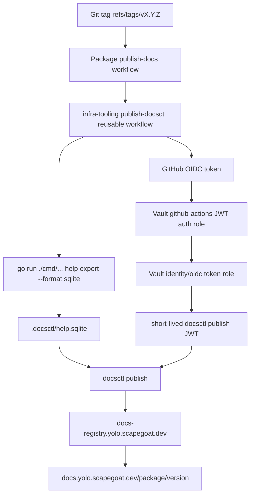

# Workspace docsctl publishing rollout implementation guide

## Executive summary

This guide explains how documentation publishing works for the Go packages in `/home/manuel/workspaces/2026-06-10/add-docs-deploy`, and how this rollout wired those packages into the shared docs system at `docs.yolo.scapegoat.dev`. The target pattern is the same one described in `infra-tooling/docs/go-go-golems/playbooks/docsctl-docs-publishing-rollout-playbook.md`: every release tag exports a Glazed help database, authenticates to Vault through GitHub Actions OIDC, mints a short-lived package-scoped publish token, and uploads the SQLite database with `docsctl publish`.

The rollout intentionally excludes `glazed` and `infra-tooling`. `glazed` already has docs publishing. `infra-tooling` is the provider of the reusable workflow and rollout tooling rather than a package in this workspace rollout. `goja-bleve` was already configured and is treated as a reference/baseline; the remaining package work added workflows, fixed help export support where necessary, and added Vault roles.

## Scope and package table

| Workspace dir | Go module | Public docs package | Exporting command | Workflow path | Vault role | Notes |
|---|---|---|---|---|---|---|
| `devctl` | `github.com/go-go-golems/devctl` | `devctl` | `./cmd/devctl` | `.github/workflows/publish-docs.yaml` | `docsctl-devctl-publisher` | New separate docs workflow. |
| `docmgr` | `github.com/go-go-golems/docmgr` | `docmgr` | `./cmd/docmgr` | `.github/workflows/release.yml` | `docsctl-docmgr-publisher` | Existing release-coupled job; bumped Glazed so `help export --format sqlite` exists. |
| `goja-bleve` | `github.com/go-go-golems/goja-bleve` | `goja-bleve` | `cmd/goja-bleve` nested module | `.github/workflows/publish-docs.yaml` | `docsctl-goja-bleve-publisher` | Already configured before this step. |
| `llm-proxy` | `github.com/go-go-golems/llm-proxy` | `llm-proxy` | `./cmd/llm-proxy-server` | `.github/workflows/publish-docs.yaml` | `docsctl-llm-proxy-publisher` | Converted stdlib flag server to Cobra + Glazed help. |
| `logcopter` | `github.com/go-go-golems/logcopter` | `logcopter` | `./cmd/logcopter-gen` | `.github/workflows/publish-docs.yaml` | `docsctl-logcopter-publisher` | Converted stdlib flag generator to Cobra + Glazed help. |
| `react-chat` | `github.com/go-go-golems/chat-overlay` | `chat-overlay` | `./cmd/chat-overlay` | `.github/workflows/publish-docs.yaml` | `docsctl-chat-overlay-publisher` | Repository name differs from module/package name. |
| `remarquee` | `github.com/go-go-golems/remarquee` | `remarquee` | `./cmd/remarquee` | `.github/workflows/publish-docs.yaml` | `docsctl-remarquee-publisher` | Terraform role moved from release workflow to separate docs workflow. |
| `scraper` | `github.com/go-go-golems/scraper` | `scraper` | `./cmd/scraper` | `.github/workflows/publish-docs.yaml` | `docsctl-scraper-publisher` | New separate docs workflow. |
| `sessionstream` | `github.com/go-go-golems/sessionstream` | `sessionstream` | `./cmd/sessionstream-systemlab` | `.github/workflows/publish-docs.yaml` | `docsctl-sessionstream-publisher` | Package name differs from binary name. |
| `vm-system` | `github.com/go-go-golems/vm-system` | `vm-system` | `./cmd/vm-system` | `.github/workflows/publish-docs.yaml` | `docsctl-vm-system-publisher` | New `.github/workflows` directory. |

## System architecture

The docs publishing system has four trust boundaries:

1. **Package repository:** owns source code, embedded help docs, and the tag workflow.
2. **Reusable workflow in `infra-tooling`:** centralizes installation, export, Vault login, token minting, publish, and verification logic.
3. **Vault:** validates GitHub OIDC claims and mints package-scoped docs-registry JWTs.
4. **Docs registry/browser:** validates publish JWTs, stores immutable package/version SQLite exports, and serves them through `docs.yolo.scapegoat.dev`.



The registry does not trust repository secrets. Instead, GitHub proves the workflow identity to Vault, Vault verifies bound claims, and Vault mints a short-lived JWT containing `token_use=docsctl-publish` and `package=<package>`. The docs registry accepts the upload only when that signed package claim matches the uploaded package route.

## API and command contracts

### Glazed help export contract

Every package must support this command shape:

```bash
GOWORK=off go run ./cmd/<binary> help export \
  --format sqlite \
  --output-path .docsctl/help.sqlite
```

The reusable workflow creates the `.docsctl` directory and then runs the configured `export_command`. Local validation should do the same explicitly:

```bash
rm -rf .docsctl
mkdir -p .docsctl
GOWORK=off go run ./cmd/<binary> help export --format sqlite --output-path .docsctl/help.sqlite
test -s .docsctl/help.sqlite
docsctl validate --file .docsctl/help.sqlite --package <package> --version v0.0.0-local
rm -rf .docsctl
```

### Reusable workflow contract

The reusable workflow lives at `infra-tooling/.github/workflows/publish-docsctl.yml`. Package workflows call it like this:

```yaml
jobs:
  publish-docs:
    permissions:
      contents: read
      id-token: write
    uses: go-go-golems/infra-tooling/.github/workflows/publish-docsctl.yml@main
    with:
      package_name: <package>
      package_version: ${{ github.ref_name }}
      export_command: GOWORK=off go run ./cmd/<binary> help export --format sqlite --output-path .docsctl/help.sqlite
      sqlite_path: .docsctl/help.sqlite
      vault_role: docsctl-<package>-publisher
      vault_token_role: docsctl-<package>-publisher
```

`id-token: write` must be scoped to the `publish-docs` job. Do not grant it at workflow root unless every job really needs OIDC.

### Vault role contract

Each docs package has one entry in `/home/manuel/code/wesen/terraform/vault/github-actions/envs/k3s/main.tf` under `local.docsctl_publishers`:

```hcl
<package> = {
  package_name  = "<package>"
  repository    = "go-go-golems/<repo>"
  repository_id = "<numeric GitHub databaseId>"
  workflow_ref  = "go-go-golems/<repo>/.github/workflows/publish-docs.yaml@refs/tags/v*"
}
```

Terraform then creates:

- `vault_identity_oidc_role.docsctl_publish[<package>]`: mints the package-specific publish JWT.
- `vault_policy.docsctl_publish[<package>]`: lets the GitHub Actions Vault token read only that identity token endpoint.
- `vault_jwt_auth_backend_role.docsctl_publish[<package>]`: validates GitHub OIDC claims, including repository ID, tag ref, workflow path, reusable workflow ref, and event name.

## Implementation notes by package

### Packages that only needed a workflow

`devctl`, `scraper`, `sessionstream`, `vm-system`, and `remarquee` already had Glazed help export support. The implementation added `.github/workflows/publish-docs.yaml` files that call the reusable workflow. `sessionstream` uses `./cmd/sessionstream-systemlab` as the exporter but publishes under the package name `sessionstream`.

### `docmgr`

`docmgr` already had a release-coupled `publish-docs` job in `.github/workflows/release.yml`, but `GOWORK=off go run ./cmd/docmgr help export --format sqlite ...` failed with `unknown flag: --format`. The root cause was the older published Glazed dependency (`v1.0.5`) not containing the current help export command. Updating `github.com/go-go-golems/glazed` to `v1.3.6` fixed local SQLite export validation.

### `llm-proxy`

`llm-proxy-server` previously used the standard library `flag` package and immediately started the HTTP server. Running `help export` therefore started the server instead of exporting docs. The fix converted the entrypoint to a Cobra root command, wired Glazed logging flags, added `help_cmd.SetupCobraRootCommand`, and added an embedded help topic under `pkg/doc/topics/llm-proxy-overview.md`.

Pseudocode:

```go
func newRootCommand() *cobra.Command {
    opts := &serverOptions{}
    root := &cobra.Command{
        Use: "llm-proxy-server",
        RunE: func(cmd *cobra.Command, args []string) error {
            return runServer(cmd.Context(), opts)
        },
        PersistentPreRunE: logging.InitLoggerFromCobra,
    }
    root.Flags().StringVar(&opts.listen, "listen", "127.0.0.1:8080", "...")
    root.Flags().StringVar(&opts.profiles, "profiles", "", "...")
    logging.AddLoggingSectionToRootCommand(root, "llm-proxy")
    hs := help.NewHelpSystem()
    llmproxydoc.AddDocToHelpSystem(hs)
    help_cmd.SetupCobraRootCommand(hs, root)
    return root
}
```

### `logcopter`

`logcopter-gen` previously used `flag.FlagSet`, so `help export` was parsed as generator input and failed with `-area-prefix is required`. The fix converted the generator entrypoint to Cobra while preserving the existing flag names and generator behavior. It also added a minimal embedded help topic. This adds a Glazed dependency to `logcopter`; reviewers should consider that acceptable because docsctl publishing requires the Glazed help export machinery.

### `react-chat` / `chat-overlay`

The repository is named `react-chat`, but the module is `github.com/go-go-golems/chat-overlay` and the command is `chat-overlay`. The docs package name was therefore chosen as `chat-overlay`. The committed `replace github.com/go-go-golems/pinocchio => ../pinocchio` broke `GOWORK=off` validation because this workspace does not contain `../pinocchio`; `go mod tidy` resolved the needed published Pinocchio version instead.

## `ggg` rollout tooling improvement

`infra-tooling/internal/cli/rollout/docsctl.go` was updated so `ggg rollout docsctl` is safer for this workspace:

- It derives the default docs package name from the Go module basename rather than only the repository directory name. This makes `react-chat` default to `chat-overlay`.
- It accepts `--export-command repo='shell command'` overrides, which is necessary for nested command modules like `goja-bleve`.
- Validation now runs the candidate export command through `bash -lc` and substitutes `.docsctl/help.sqlite` with a temporary SQLite path, so inventory/plan output and validation behavior use the same command contract.

The validated plan for this rollout is stored at `sources/02-ggg-docsctl-plan.yaml`.

## Validation evidence

`ggg rollout docsctl plan` validated the selected packages successfully. Key results:

| Package | Sections | Status |
|---|---:|---|
| `devctl` | 6 | `validate_ok` |
| `docmgr` | 17 | `validate_ok` |
| `llm-proxy` | 1 | `validate_ok` |
| `logcopter` | 2 | `validate_ok` |
| `chat-overlay` | 1 | `validate_ok` |
| `remarquee` | 12 | `validate_ok` |
| `scraper` | 11 | `validate_ok` |
| `sessionstream` | 4 | `validate_ok` |
| `vm-system` | 7 | `validate_ok` |

The exact command used was:

```bash
cd infra-tooling
go run ./cmd/ggg rollout docsctl plan \
  --workspace /home/manuel/workspaces/2026-06-10/add-docs-deploy \
  --exclude glazed --exclude infra-tooling \
  --cmd devctl=./cmd/devctl \
  --cmd docmgr=./cmd/docmgr \
  --cmd goja-bleve=./cmd/goja-bleve \
  --cmd llm-proxy=./cmd/llm-proxy-server \
  --cmd logcopter=./cmd/logcopter-gen \
  --cmd react-chat=./cmd/chat-overlay \
  --cmd remarquee=./cmd/remarquee \
  --cmd scraper=./cmd/scraper \
  --cmd sessionstream=./cmd/sessionstream-systemlab \
  --cmd vm-system=./cmd/vm-system \
  --package react-chat=chat-overlay \
  --export-command goja-bleve='mkdir -p .docsctl && (cd cmd/goja-bleve && GOWORK=off go run . help export --format sqlite --output-path ../../.docsctl/help.sqlite)' \
  --timeout 5m \
  --output yaml
```

Terraform was applied for Vault roles. The post-apply plan is stored at `sources/03-terraform-post-apply-clean-plan.log` and ended with `No changes. Your infrastructure matches the configuration.`

## Release and verification procedure

For each repository after its PR is merged:

1. Run release preflight:

   ```bash
   ggg release preflight --output json
   ```

2. Tag using the normal release helper:

   ```bash
   ggg release tag-patch --dry-run --yes --output json
   ggg release tag-patch --yes --output json
   ```

3. Watch the docs workflow. For separate docs workflows:

   ```bash
   gh run list --workflow publish-docs.yaml --limit 5
   gh run watch <run-id> --exit-status
   ```

4. Verify production docs:

   ```bash
   ggg release verify-docs --package <package> --version vX.Y.Z --output json
   ```

5. Open the browser URL:

   ```text
   https://docs.yolo.scapegoat.dev/<package>/vX.Y.Z
   ```

## Risks and review checklist

- **Immutable versions:** the registry rejects different bytes for an already-published package/version. Fix mistakes by cutting a new release tag.
- **Workflow path binding:** Vault roles bind exact workflow paths. Renaming `publish-docs.yaml` requires Terraform updates.
- **Package naming:** `chat-overlay` is intentionally not `react-chat`; reviewers should confirm this public URL choice.
- **Doc quality:** `llm-proxy`, `logcopter`, and `chat-overlay` currently have minimal embedded topics. They are valid for publishing, but future work should expand them into richer user docs.
- **`logcopter` dependency:** adding Glazed to `logcopter` increases dependency weight for docs export. If this is unacceptable later, split docs export into a separate docs-only command; do not remove publishing without an alternative.

## File references

- Playbook: `infra-tooling/docs/go-go-golems/playbooks/docsctl-docs-publishing-rollout-playbook.md`.
- Reusable workflow: `infra-tooling/.github/workflows/publish-docsctl.yml`.
- Workflow template: `infra-tooling/templates/github/publish-docsctl.template.yml`.
- `ggg` docsctl helper: `infra-tooling/internal/cli/rollout/docsctl.go`.
- Terraform Vault roles: `/home/manuel/code/wesen/terraform/vault/github-actions/envs/k3s/main.tf`.
- Validation plan: `infra-tooling/ttmp/2026/06/10/INFRA-006--plan-docsctl-documentation-publishing-rollout-for-workspace-packages/sources/02-ggg-docsctl-plan.yaml`.
- Post-apply Terraform plan: `infra-tooling/ttmp/2026/06/10/INFRA-006--plan-docsctl-documentation-publishing-rollout-for-workspace-packages/sources/03-terraform-post-apply-clean-plan.log`.
